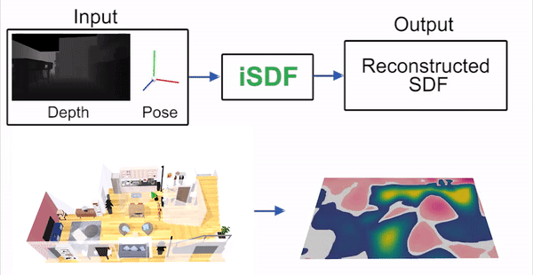

# iSDF: Real-time Neural Signed Distance Fields for Robot Perception

### [Project Page](https://joeaortiz.github.io/iSDF/) | [Paper](https://arxiv.org/abs/2204.02296)

iSDF is real-time system the reconstructs the signed distance field (SDF) of room scale environments through the online training of a neural SDF. The model is represented by a MLP that is trained in a continual learning style from a live stream of posed depth images using our self-supervised loss. For details see our [paper](https://arxiv.org/abs/2204.02296).




### Example results

ReplicaCAD             |  ScanNet
:-------------------------:|:-------------------------:
  |  


## Installation 

```
git clone https://github.com/facebookresearch/iSDF.git && cd iSDF
```

To setup the environment.

```
conda env create -f environment.yml
conda activate isdf
pip install -e .
```

Install pytorch by following instructions [here](https://pytorch.org/get-started/locally/).

## Downloading the data

Make sure to be in the conda environment.
To download a single replicaCAD sequence (5GB):
```
bash data/download_apt_2_nav.sh
```
To download all 12 sequences (15GB):
```
bash data/download_data.sh
```

The data is shared under the same [license](https://creativecommons.org/licenses/by/4.0/) as the Replica-CAD datset. 

For instructions on how to generate the dataset see the [data README](data).

### ScanNet sequences

To run the ScanNet sequences, you must download the [ScanNet dataset](http://www.scan-net.org/). After downloading the scans, you should export the depth, color, poses and intrinsics for the sequences you wish to use with [this script](https://github.com/ScanNet/ScanNet/tree/master/SensReader/python).  

## Usage

If using ScanNet data, then you must set the directory for the downloaded sequence via the key `scannet_dir` in the config file.

```
cd isdf/train/
python train.py --config configs/replicaCAD.json
```

Press `s` to pause optimisation and view the reconstructed level set mesh.

## Reproducing experiments

Run a batch of iSDF experiments sequentially in headless mode. To run these experiments you must have downloaded all 12 sequences using our bash script as well as separately downloading and exporting the ScanNet sequences. To run only the ReplicaCAD sequences, you can modify the `load_params` function in `batch_utils.py`. If you have multiple GPUs you may want to parallelise the experiment runs. Make sure to update `project_dir` and `scannet_dir` in `jobs_local.py` before running:

```
cd isdf/train
python batch_train/jobs_local.py
```

We have provided results for the baselines that we use in the paper for those wanted to reproduce results for iSDF only. 
Code to reproduce results for our baselines is coming soon. 
<!-- Please see the [Voxblox readme](voxblox) and the [KinectFusion+ readme](kinectfusion+).  -->

Below we provide instructions to generate quantitative and qualitative results as in the paper. Note results may vary depending on the CPU / GPU used.

### SDF accuracy plots

We provide the script to generate plots comparing SDF error, collision cost error and gradient cosine distance for iSDF and the two baselines. This script was used to generate all quantitative plots in the paper (e.g. Fig 8). Change the variable `isdf_dir` in the script before running:

```
python isdf/eval/figs/all_seq.py
```

## Citation

```
@article{Ortiz:etal:iSDF2022,
  title={iSDF: Real-Time Neural Signed Distance Fields for Robot Perception},
  author={Ortiz, Joseph and Clegg, Alexander and Dong, Jing and Sucar, Edgar and Novotny, David and Zollhoefer, Michael and Mukadam, Mustafa},
  journal={arXiv preprint arXiv:2204.02296},
  year={2022}
}
```

## License

iSDF is released under the MIT license. Please see the [LICENSE](LICENSE) file for more information.

## Contributing

We actively welcome your pull requests! Please see [CONTRIBUTING.md](.github/CONTRIBUTING.md) and [CODE_OF_CONDUCT.md](.github/CODE_OF_CONDUCT.md) for more info.
